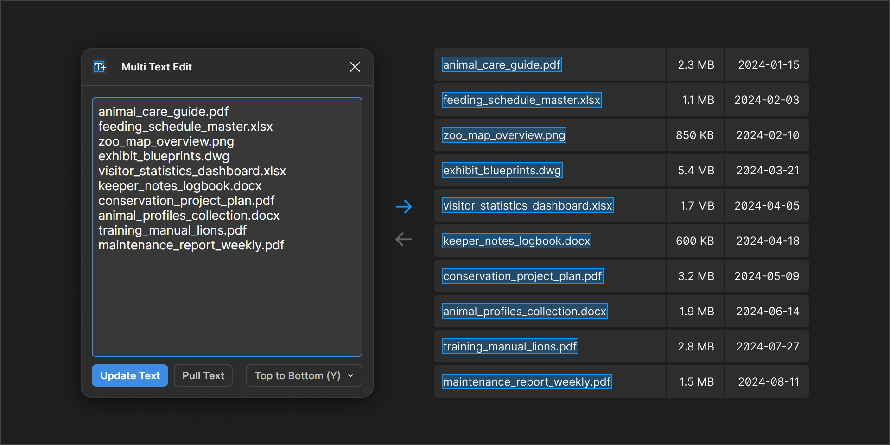

# Multi Text Editor - Figma Plugin
Edit multiple text elements in a single text editor

[Figma Plugin Page](https://www.figma.com/community/plugin/1430752760757770874/multi-text-edit)

---

## TODOs
- Icons
- Button: Select Text Node Children elements
- Button: help text
  - Write in Readme
  - Add HTML version

## BUGS?
- Register undo? Figma should do this?
- Update text is one revision behind? Figma's fault?
